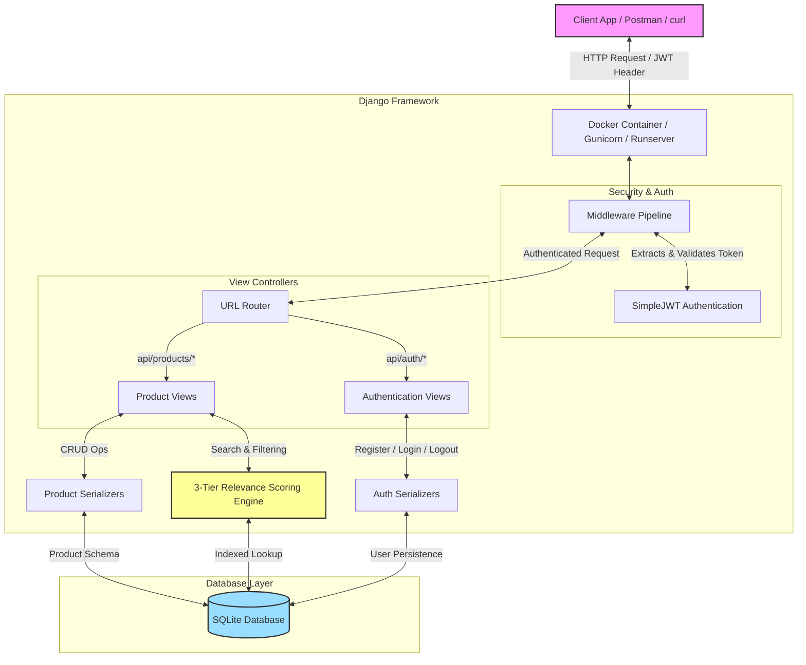

# Rivyou Product Search Platform

A high-performance product discovery and search API backend built using Django, Django Rest Framework (DRF), and SQLite. This platform implements a custom **3-tier relevance search ranking engine** designed to return search results ordered by context relevance rather than simple database queries, and secures endpoints using JSON Web Tokens (JWT).

---

## 🏗️ System Architecture

The following diagram illustrates how incoming client requests flow through the application layers, middleware authentication, the router, and the search ranking engine before returning a response:



---

## 🌟 Key Features

1. **3-Tier Search Ranking Algorithm**: Orders messy, tag-heavy products to prioritize actual items (e.g. phones) before auxiliary items (e.g. back covers) tagged with the search term.
2. **Secure JWT Authentication**: Implements registers, logins, and logouts (using JWT token blacklisting to prevent token hijacking).
3. **Interactive API Documentation (Swagger & Redoc)**: Configured using OpenAPI 3.0 via `drf-spectacular` with detailed request/response schemas for all viewpoints.
4. **Auto-seeding and Migration on Containerization**: Ready-to-go Docker configuration that installs packages, runs migrations, seeds 1,000 product rows, and creates a default superuser out of the box.

---

## 📊 Endpoints Reference

| Category | HTTP Method | Endpoint Path | Authentication | Description |
| :--- | :--- | :--- | :--- | :--- |
| **Auth** | `POST` | `/api/auth/register` | Public | Registers a user; returns JWT token + refresh token. |
| **Auth** | `POST` | `/api/auth/login` | Public | Authenticates credentials; returns JWT tokens. |
| **Auth** | `POST` | `/api/auth/logout` | Authenticated | Blacklists a refresh token to terminate session. |
| **Products**| `GET` | `/api/products/search` | Authenticated | Searches products, computes relevance, and sorts. |
| **Products**| `GET` | `/api/products/<id>` | Authenticated | Retrieves a single product detail with its tags. |
| **Products**| `GET` | `/api/products/category/<name>` | Authenticated | Lists all products in a specific category. |
| **Products**| `POST` | `/api/products/` | Admin Only | Creates a new product with custom tags. |
| **Docs** | `GET` | `/api/schema/` | Public | Downloads raw OpenAPI v3 YAML schema. |
| **Docs** | `GET` | `/api/schema/swagger-ui/`| Public | Opens the interactive Swagger UI interface. |
| **Docs** | `GET` | `/api/schema/redoc/` | Public | Opens the clean Redoc UI representation. |

---

## 🔍 The Search Scoring Engine (3-Tier Logic)

When a search is performed via `GET /api/products/search?q=<query>`, the scoring engine evaluates every matching product across three tiers. Results are sorted in descending order of their relevance score, using the alphabetical product name as a tiebreaker.

```
Relevance Score Hierarchy:
[Tier 1: Category Match] (0.85 - 1.00)  >  [Tier 2: Tag Match] (0.50 - 0.80)  >  [Tier 3: Content Match] (0.10 - 0.45)
```

### Scoring Formula Breakdown:
*   **Tier 1: Category Match (Score Range: `0.85 - 1.00`)**
    *   Triggered when the search query matches the product's `category`.
    *   **Base Score**: `0.85`
    *   **Tag Matching Bonus**: Adds `+0.03` for each matching tag, capped at `+0.15` max.
    *   *Formula*: `Score = min(0.85 + (matching_tags * 0.03), 1.00)`
*   **Tier 2: Tag Match (Score Range: `0.50 - 0.80`)**
    *   Triggered when a tag matches the query, but the category itself does not.
    *   **Exact Tag Match** (`0.70 - 0.80`): Adds `+0.05` per exact tag match.
    *   **Partial Tag Match** (`0.50 - 0.65`): Adds `+0.05` per partial tag match.
*   **Tier 3: Name & Description Match (Score Range: `0.10 - 0.45`)**
    *   Triggered when query is only found in description or product name.
    *   **Name & Description match**: `0.45`
    *   **Name match only**: `0.40`
    *   **Description match only**: `0.20`

---

## 📘 Interactive API Documentation

Interactive API documents are generated automatically using OpenAPI 3.0 schema definitions.

💡 **Root URL Redirect**: Visiting the base URL (`http://localhost:8000/`) will automatically redirect you straight to the Swagger UI page for a seamless developer experience!

1.  **Swagger UI Console**: Navigate to [http://localhost:8000/api/schema/swagger-ui/](http://localhost:8000/api/schema/swagger-ui/) (or simply [http://localhost:8000/](http://localhost:8000/)) to test live API calls directly.
2.  **Redoc Documentation**: Navigate to [http://localhost:8000/api/schema/redoc/](http://localhost:8000/api/schema/redoc/) for a clean, documentation-first format.

### 🔑 Testing Authenticated Endpoints in Swagger:
1. Trigger the `/api/auth/login` endpoint in the Swagger console (using username and password).
2. Copy the returned `"token"` (access token) string.
3. Scroll back to the top of the Swagger UI and click the green **Authorize** button.
4. Enter: `Bearer <your_copied_token>` (e.g. `Bearer eyJhbGciOi...`) and click **Authorize**.
5. All product endpoints are now authorized and ready for live testing inside your browser!

---

## 🐳 Quick Start: Running with Docker (Recommended)

Docker sets up the entire application environment, applies database migrations, imports the 1,000 product catalog from the CSV file, and creates a default admin user.

### Prerequisites
Make sure you have [Docker](https://www.docker.com/) installed on your machine.

### Instructions

1.  **Launch the Services**:
    Build the image and launch the container in the foreground:
    ```bash
    docker-compose up --build
    ```
2.  **Access the Application**:
    The API server is exposed at `http://localhost:8000` (which automatically redirects to the Swagger UI).
3.  **Default Admin Account**:
    An admin account is automatically created on launch:
    *   **Username**: `admin`
    *   **Password**: `adminpassword`
4.  **Shutdown**:
    To stop the container, run:
    ```bash
    docker-compose down
    ```

---

## 💻 Local Setup (Without Docker)

To run the application directly on your local system using Python:

### Step 1: Create and Activate Virtual Environment
```bash
# Windows
python -m venv venv
.\venv\Scripts\activate

# macOS / Linux
python3 -m venv venv
source venv/bin/activate
```

### Step 2: Install Dependencies
```bash
pip install -r requirements.txt
```

### Step 3: Run Database Migrations
```bash
python manage.py migrate
```

### Step 4: Seed the Product Catalog
Import the 1,000 products CSV data:
```bash
python manage.py load_products --clear
```

### Step 5: Create a Superuser (Optional)
To test admin endpoints (such as product creation), create a superuser profile:
```bash
python manage.py createsuperuser
```

### Step 6: Launch Development Server
```bash
python manage.py runserver
```
The server will start running at `http://127.0.0.1:8000`.

---

## 🧪 Testing with curl / CLI Examples

Below are standard HTTP client commands to test the endpoints from your terminal:

### 1. Register a New User
```bash
curl -X POST http://localhost:8000/api/auth/register \
     -H "Content-Type: application/json" \
     -d '{"username": "johndoe", "email": "johndoe@example.com", "password": "securepassword123"}'
```

### 2. Login & Obtain Tokens
```bash
curl -X POST http://localhost:8000/api/auth/login \
     -H "Content-Type: application/json" \
     -d '{"username": "johndoe", "password": "securepassword123"}'
```
*Response contains a token: `"token": "eyJhbGciOiJ..."`.*

### 3. Search and Rank Products
```bash
curl -X GET "http://localhost:8000/api/products/search?q=smartphone&limit=5" \
     -H "Authorization: Bearer <your_access_token>"
```

### 4. Create a Product (Admin Credentials Required)
```bash
curl -X POST http://localhost:8000/api/products/ \
     -H "Content-Type: application/json" \
     -H "Authorization: Bearer <admin_access_token>" \
     -d '{"product_name": "Premium Charger Pro", "product_description": "Fast charger compatible with all smartphones", "category": "Chargers", "tags": ["charger", "fast charger", "usb-c"]}'
```

### 5. Logout
```bash
curl -X POST http://localhost:8000/api/auth/logout \
     -H "Content-Type: application/json" \
     -H "Authorization: Bearer <your_access_token>" \
     -d '{"refresh": "<your_refresh_token>"}'
```
